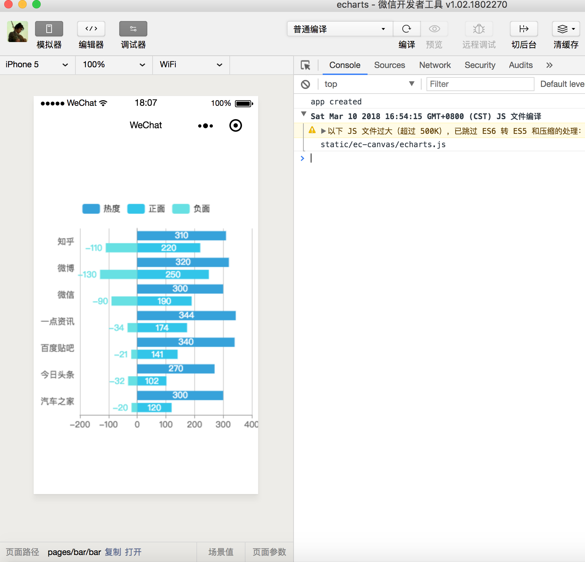

# echarts 用法示例

## 请注意微信版本要求
支持微信版本 >= 6.6.3，对应基础库版本 >= 1.9.91。

调试的时候，需要在微信开发者工具中，将“详情”下的“调试基础库”设为 1.9.91 及以上版本。

发布前，需要在 [https://mp.weixin.qq.com](https://mp.weixin.qq.com) 的“设置”页面，将“基础库最低版本设置”设为 1.9.91。当用户微信版本过低的时候，会提示用户更新。

## 具体操作

1. 下载 [echarts-for-weixin](https://github.com/ecomfe/echarts-for-weixin) 。

2. 把其 `ec-canvas` 目录移动到 mpvue 项目的 `static` 目录下。

3.  对 `ec-canvas/ec-canvas.js` 进行小调整，考虑提 pr 到 ec-canvas。

修改 ready 为异步获取数据。

``` javascript
  ready: function () {
  // 异步获取
    setTimeout(() => {
      if (!this.data.ec) {
        console.warn('组件需绑定 ec 变量，例：<ec-canvas id="mychart-dom-bar" '
          + 'canvas-id="mychart-bar" ec="{{ ec }}"></ec-canvas>');
        return;
      }

      if (!this.data.ec.lazyLoad) {
        this.init();
      }
    }, 10)
  }
```

为 init 添加接收 options 传参

```
      var query = wx.createSelectorQuery().in(this);
      query.select('.ec-canvas').boundingClientRect(res => {
        if (typeof callback === 'function') {
          this.chart = callback(canvas, res.width, res.height);
        }
        else if (this.data.ec && this.data.ec.onInit) {
          this.chart = this.data.ec.onInit(canvas, res.width, res.height);
        }
        else if (this.data.ec && this.data.ec.options) {
        // 添加接收 options 传参
          const ec = this.data.ec

          function initChart(canvas, width, height) {
            const chart = echarts.init(canvas, null, {
              width: width,
              height: height
            });
            canvas.setChart(chart);
            chart.setOption(ec.options);
            return chart;
          }
          this.chart = initChart(canvas, res.width, res.height);
        }
      }).exec();
```

4. 创建 `pages/bar` 页面，目录如下：

```
.
└── pages
    └── bar
        ├── index.vue
        └── main.js
```

5. 在 main.js 中引入微信小程序的自定义组件

``` javascript
import Vue from 'vue'
import App from './index'

const app = new Vue(App)
app.$mount()

// 添加 config json
export default {
  config: {
    // 这儿添加要用的小程序组件
    usingComponents: {
      'ec-canvas': '../../../static/ec-canvas/ec-canvas'
    }
  }
}
```

6. 在 app.vue 中添加 options、template 等相关配置

```
<template>
  <div>
    <div class="container">
      <ec-canvas class="canvas" id="mychart-dom-bar" canvas-id="mychart-bar" :ec="ec"></ec-canvas>
    </div>
  </div>
</template>

<script>
const options = {
    // more code ... 
}

export default {
  data () {
    return {
      ec: {
        // 传 options
        options: options,
      }
    }
  }
}

</script>

<style>
ec-canvas {
  width: 400px;
  height: 400px;
}

</style>
```

最终效果：



## Build Setup

``` bash
# install dependencies
npm install

# serve with hot reload at localhost:8080
npm run dev

# build for production with minification
npm run build

# build for production and view the bundle analyzer report
npm run build --report
```

For detailed explanation on how things work, checkout the [guide](http://vuejs-templates.github.io/webpack/) and [docs for vue-loader](http://vuejs.github.io/vue-loader).
